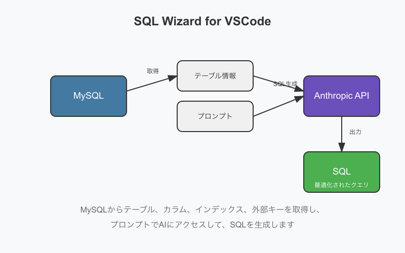

# SQL Wizard for VSCode

SQL Wizard is a VSCode extension that retrieves tables, columns, indexes, and foreign keys from MySQL databases, accesses AI with prompts, and generates SQL. It can create JOIN queries across multiple tables with correct column names and efficient index usage.

## Features

- **Database Schema Analysis**: Automatically extracts tables, columns, indexes, and foreign keys from MySQL databases
- **AI-Powered Query Generation**: Generates SQL from natural language prompts
- **Optimized Queries**: Creates JOIN queries across multiple tables with correct column names and efficient index usage
- **Multilingual**: Supports both English and Japanese interfaces

## How It Works

SQL Wizard fetches tables, columns, indexes, and foreign keys from MySQL, accesses AI with the prompt, and generates optimized SQL queries.

## Quick Start

1. Install from VSCode Marketplace
2. Connect to your MySQL database
3. Enter your query in natural language
4. Get optimized SQL instantly

---

# SQL Wizard for VSCode

SQL Wizardは、MySQLからテーブル・カラム・インデックス・外部キーを取得して、プロンプトとともにAIにアクセスし、SQLを生成するVSCode拡張機能です。複数のテーブルをJOINしてカラム名などに誤りがなく、インデックスが効いたSQLを生成することができます。

## 機能

- **データベーススキーマ分析**: MySQLからテーブル・カラム・インデックス・外部キーを自動的に取得
- **AIによるクエリ生成**: 自然言語のプロンプトからSQLを生成
- **最適化されたクエリ**: 複数のテーブルをJOINし、カラム名に誤りがなく、インデックスが効いたSQLを生成
- **多言語対応**: 日本語と英語のインターフェースをサポート

## 仕組み

SQL Wizardは、MySQLからテーブル、カラム、インデックス、外部キーを取得し、プロンプトでAIにアクセスして、最適化されたSQLクエリを生成します。

## クイックスタート

1. VSCodeマーケットプレイスからインストール
2. MySQLデータベースに接続
3. 自然言語でクエリを入力
4. 最適化されたSQLをすぐに取得
